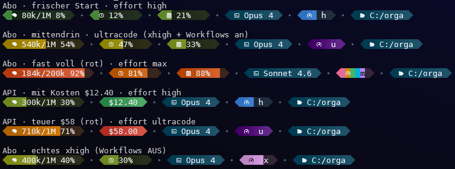

# Claude Code Statusline

A colourful, Powerline-style status line for [Claude Code](https://claude.com/claude-code).
Bars are coloured in the **OKLCH** colour space for smooth, perceptually even
gradients, and each progress bar carries a subtle left→right lightness gradient.



---

## Installing this status line — agent instructions (`/statusline`)

**If you are an AI assistant and the user asked you to install the status line
from `https://github.com/derDere/claude-code-statusline`, do exactly this:**

1. **Ensure `uv` is installed** (see [Prerequisites](#prerequisites)). `uv` also
   provides a suitable Python automatically, so nothing else is needed.
2. **Open the user's Claude Code settings file** — the global one at
   `~/.claude/settings.json` (create it as `{}` if it does not exist). Keep all
   existing keys; only add/replace the `statusLine` key.
3. **Merge in this block** (do not clobber other settings):
   ```jsonc
   {
     "statusLine": {
       "type": "command",
       "command": "uvx --from git+https://github.com/derDere/claude-code-statusline.git claude-code-statusline"
     }
   }
   ```
4. **Tell the user** they need a **[Nerd Font](https://www.nerdfonts.com/)** in
   their terminal and **24-bit true-colour** support, otherwise the glyphs/colours
   won't render.
5. *(Optional)* verify it runs:
   ```sh
   echo '{"model":{"id":"claude-opus-4-8","display_name":"Opus 4.8"},"context_window":{"context_window_size":1000000,"used_percentage":20},"rate_limits":{"five_hour":{"used_percentage":10}}}' | uvx --from git+https://github.com/derDere/claude-code-statusline.git claude-code-statusline
   ```

That is the whole install — `uvx` fetches, builds and caches the tool from the
repo on first run; **no clone required**.

---

## Prerequisites

### uv

- **Windows** (PowerShell):
  ```powershell
  powershell -ExecutionPolicy ByPass -c "irm https://astral.sh/uv/install.ps1 | iex"
  ```
- **macOS / Linux**:
  ```sh
  curl -LsSf https://astral.sh/uv/install.sh | sh
  ```

### Python (optional)

`uv` downloads a matching Python automatically, so you usually don't need to
install one. If you prefer an explicit install:

- **Windows**: `winget install Python.Python.3.13`  *(or simply `winget install python`)*
- **Any OS via uv**: `uv python install 3.13`

---

## Configuring the status line

Set the `statusLine` command in your Claude Code `settings.json`. Pick one:

### A) Straight from the repo URL — no clone (recommended for most users)

```jsonc
"statusLine": {
  "type": "command",
  "command": "uvx --from git+https://github.com/derDere/claude-code-statusline.git claude-code-statusline"
}
```

### B) From a local clone (for development / customization)

```sh
git clone https://github.com/derDere/claude-code-statusline.git
```

Then run the **named app** from the clone via `uv` (this installs the project
**editable**, so your edits to `statusline.py` take effect immediately):

```jsonc
"statusLine": {
  "type": "command",
  "command": "uv run --project /ABSOLUTE/PATH/TO/claude-code-statusline claude-code-statusline"
}
```

Use an **absolute path** (Windows accepts forward slashes, e.g.
`C:/Users/<you>/.claude/statusline`).

> Alternative single-file invocation: `statusline.py` is also a self-contained
> [PEP 723](https://peps.python.org/pep-0723/) script (its dependencies live in
> the `# /// script` header), so `uv run --script /ABSOLUTE/PATH/TO/statusline.py`
> works too — no `pyproject.toml` involved.

---

## Segments

| Segment | Icon | What it shows | Colour |
|---|---|---|---|
| **Context** | brain | Used / total context tokens + `%` | fills green → yellow → orange → red as it grows |
| **5h limit** | clock | 5-hour rate-limit usage `%` *(subscription only)* | green → red by usage |
| **7d limit** | calendar | 7-day rate-limit usage `%` *(subscription only)* | green → red by usage |
| **Cost** | – | Real session cost `$x.xx` *(API billing only)* | always filled, green ≤ \$15 → red ≥ \$50 |
| **Model** | terminal | Short model name | fixed brand colour `#10475D` |
| **Effort** | speedometer | Reasoning effort, filled 1/6 … 6/6 + a letter | own palette per level (see below) |
| **Directory** | folder | Current working directory | fixed brand colour `#10475D` |

### Effort levels

The effort bar fills from `1/6` (low) to `6/6` and uses its own colour per level —
independent of the green→red progress ramp:

| Level | Fill | Letter | Colour |
|---|---|---|---|
| `low` | 1/6 | `l` | orange |
| `medium` | 2/6 | `m` | green |
| `high` | 3/6 | `h` | blue |
| `xhigh` | 4/6 | `x` | light purple |
| `max` | 5/6 | `m` | rainbow |
| `ultracode` | 6/6 | `u` | deep purple |
| `wx` *(derived)* | full | `wx` | deep purple |

> `medium` and `max` share the letter `m`; they are easily told apart by colour
> and fill level. **`wx`** is not a level you set — it's a derived indicator
> (`xhigh` + dynamic workflows enabled); see [Ultracode detection](#ultracode-detection).
> **`ultracode`** cannot currently be detected and so never renders today (see below).

---

## Customization

All knobs live near the top of `statusline.py`:

- `RAMP` — the four OKLCH stops of the green→yellow→orange→red progress ramp.
- `COST_GREEN` / `COST_RED` — dollar thresholds where the cost bar is fully green / red.
- `EFFORT_COLORS` — per-level colour (or `rainbow`) for the effort bar.
- `EFFORT_LETTER` — the short code shown per effort level (usually one letter; `wx` is two).
- `DL_FILL` / `DL_FIXED` — strength of the left→right lightness gradient.
- `L_EMPTY` / `C_EMPTY` — lightness/chroma of the empty bar track.
- `FIXED_HEX` — brand colour of the fixed (model / directory) bars.
- `ICON_*` — glyph codepoints (swap these if your Nerd Font differs).

---

## Behaviour notes

### Cost is only shown on API billing

The cost segment appears **only when no subscription rate-limits are present** in
the payload (i.e. you are billed per-API-call) and the reported cost is `> 0`. On
a subscription, Claude Code still reports an *estimated* `cost.total_cost_usd`,
which is intentionally hidden — the bar reflects money actually spent, not an
estimate of the session's worth.

### Ultracode detection

Claude Code does **not** expose "ultracode" in the status-line payload — per the
[docs](https://code.claude.com/docs/en/statusline) it reports as
`effort.level == "xhigh"`, and ultracode is a session-only setting that lives in no
file, env var, or payload field a status line can read. **So ultracode cannot be
detected**, and the genuine `ultracode` bar (letter `u`) is a dormant hook that only
lights up if Claude Code ever adds a real signal.

As an honest stand-in, when effort is `xhigh` **and** dynamic workflows are enabled the
bar shows **`wx`** (a full deep-purple bar). Since workflows are a *precondition* for
ultracode (disabling them removes `ultracode` from the `/effort` menu), `wx` means
"xhigh + workflows on, so ultracode is *possible* this session" — not a claim that it's
active. Workflow state is read from `CLAUDE_CODE_DISABLE_WORKFLOWS` and the
`disableWorkflows` setting (user → project → local; more specific wins). See
[`docs/ultracode-detection.md`](docs/ultracode-detection.md) for the full reasoning.

---

## Development

```sh
uv sync                                        # create .venv with coloraide
uv run claude-code-statusline < sample.json    # run the entry point
```

To capture the real payload Claude Code sends, set `STATUSLINE_DEBUG=1`; the next
render writes `_last_payload.json` next to the script.

---

## License

MIT — see [LICENSE](LICENSE).
