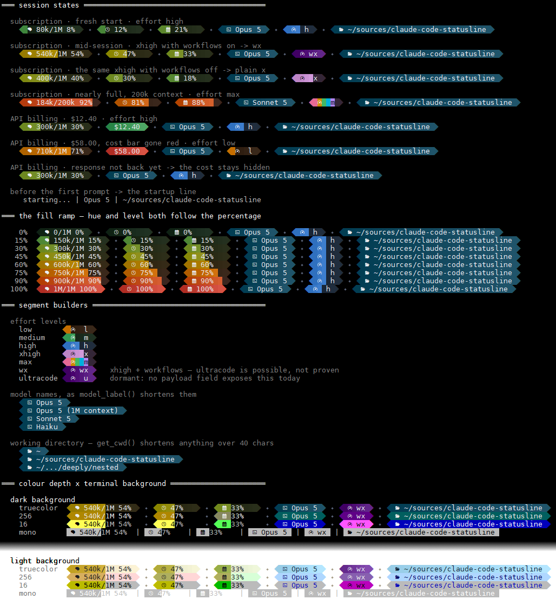

# Claude Code Statusline

A colourful, Powerline-style status line for [Claude Code](https://claude.com/claude-code).
Bars are coloured in the **OKLCH** colour space for smooth, perceptually even
gradients, and each progress bar carries a subtle left→right lightness gradient.



---

## Installing this status line — agent instructions (`/statusline`)

**If you are an AI assistant and the user asked you to install the status line
from `https://github.com/derDere/claude-code-statusline`, do exactly this:**

1. **Ensure `uv` is installed** (see [Prerequisites](#prerequisites)). `uv` also
   provides a suitable Python automatically, so nothing else is needed.
2. **Open the user's Claude Code settings file** — the global one at
   `~/.claude/settings.json` (create it as `{}` if it does not exist). Keep all
   existing keys; only add/replace the `statusLine` key.
3. **Merge in this block** (do not clobber other settings):
   ```jsonc
   {
     "statusLine": {
       "type": "command",
       "command": "uvx --from git+https://github.com/derDere/claude-code-statusline.git claude-code-statusline",
       "refreshInterval": 1
     }
   }
   ```
   `refreshInterval` is not optional here. Claude Code otherwise runs the status
   line only on events, which stop while the session is idle, and the line
   [scrolls](#scrolling-when-the-line-does-not-fit) whenever it is wider than the
   terminal — without the timer it freezes mid-scroll until the user's next
   prompt.
4. **Check 24-bit colour and repair it** — do not just mention it. Without
   truecolor the status line renders nothing but a red `NO TRUECOLOR …` banner,
   so verify the terminal the user is actually sitting in:
   - **Inside tmux** (`$TMUX` is set): `tmux display-message -p '#{client_termfeatures}'`
     must list `RGB`. If it does not, add the block below to the user's
     **`~/.tmux.conf`** (tmux reads only `~/.tmux.conf` or
     `~/.config/tmux/tmux.conf` — a file named `~/.tmuxrc` is silently ignored,
     which is a common reason correct settings appear to do nothing):
     ```tmux
     set -g default-terminal "tmux-256color"
     set -as terminal-features ",xterm*:RGB:256"
     set -as terminal-features ",screen*:RGB:256"
     set -ga terminal-overrides ",xterm*:Tc"
     setenv -g COLORTERM truecolor
     set -ga update-environment " COLORTERM"
     ```
     Then **tell the user to detach (`prefix` + `d`) and run `tmux attach` again** —
     tmux fixes a client's colour capabilities at attach time, so `source-file`
     alone changes nothing. The session and everything in it survive a re-attach.
   - **Outside tmux**: `COLORTERM` must be `truecolor` or `24bit` (or `TERM` must
     be a `*-direct` entry). Otherwise add `export COLORTERM=truecolor` to the
     user's shell profile.
   - **SSH clients that announce plain `xterm`** (Termius on iOS does) are the
     usual root cause; setting the client's terminal type to `xterm-256color`
     fixes it at the source.

   Full write-up: [`docs/terminal-truecolor.md`](docs/terminal-truecolor.md).
5. **Tell the user** they need a **[Nerd Font](https://www.nerdfonts.com/)** in
   their terminal, otherwise the glyphs won't render.
6. *(Optional)* verify it runs:
   ```sh
   echo '{"model":{"id":"claude-opus-4-8","display_name":"Opus 4.8"},"context_window":{"context_window_size":1000000,"used_percentage":20},"rate_limits":{"five_hour":{"used_percentage":10}}}' | uvx --from git+https://github.com/derDere/claude-code-statusline.git claude-code-statusline
   ```

That is the whole install — `uvx` fetches, builds and caches the tool from the
repo on first run; **no clone required**.

---

## Prerequisites

### uv

- **Windows** (PowerShell):
  ```powershell
  powershell -ExecutionPolicy ByPass -c "irm https://astral.sh/uv/install.ps1 | iex"
  ```
- **macOS / Linux**:
  ```sh
  curl -LsSf https://astral.sh/uv/install.sh | sh
  ```

### Python (optional)

`uv` downloads a matching Python automatically, so you usually don't need to
install one. If you prefer an explicit install:

- **Windows**: `winget install Python.Python.3.13`  *(or simply `winget install python`)*
- **Any OS via uv**: `uv python install 3.13`

---

## Configuring the status line

Set the `statusLine` command in your Claude Code `settings.json`. Pick one:

### A) Straight from the repo URL — no clone (recommended for most users)

```jsonc
"statusLine": {
  "type": "command",
  "command": "uvx --from git+https://github.com/derDere/claude-code-statusline.git claude-code-statusline",
  "refreshInterval": 1
}
```

### B) From a local clone (for development / customization)

```sh
git clone https://github.com/derDere/claude-code-statusline.git
```

Then run the **named app** from the clone via `uv` (this installs the project
**editable**, so your edits to `statusline.py` take effect immediately):

```jsonc
"statusLine": {
  "type": "command",
  "command": "uv run --project /ABSOLUTE/PATH/TO/claude-code-statusline claude-code-statusline",
  "refreshInterval": 1
}
```

Use an **absolute path** (Windows accepts forward slashes, e.g.
`C:/Users/<you>/.claude/statusline`).

> Alternative single-file invocation: `statusline.py` is also a self-contained
> [PEP 723](https://peps.python.org/pep-0723/) script (its dependencies live in
> the `# /// script` header), so `uv run --script /ABSOLUTE/PATH/TO/statusline.py`
> works too — no `pyproject.toml` involved.

`refreshInterval` tells Claude Code to re-run the command once a second on top of
its event-driven renders. Keep it: the line
[scrolls](#scrolling-when-the-line-does-not-fit) when it is wider than your
terminal, and events stop arriving while a session is idle, so without the timer
the line stops wherever it happened to be. `1` is the smallest value Claude Code
accepts.

---

## Segments

| Segment | Icon | What it shows | Colour |
|---|---|---|---|
| **Context** | brain | Used / total context tokens + `%` | fills green → yellow → orange → red as it grows |
| **5h limit** | clock | 5-hour rate-limit usage `%` *(subscription only)* | green → red by usage |
| **7d limit** | calendar | 7-day rate-limit usage `%` *(subscription only)* | green → red by usage |
| **Cost** | – | Real session cost `$x.xx` *(API billing only)* | always filled, green ≤ \$15 → red ≥ \$50 |
| **Model** | terminal | Short model name | fixed brand colour `#10475D` |
| **Effort** | speedometer | Reasoning effort, filled 1/6 … 6/6 + a letter | own palette per level (see below) |
| **Directory** | folder | Current working directory | fixed brand colour `#10475D` |

### Effort levels

The effort bar fills from `1/6` (low) to `6/6` and uses its own colour per level —
independent of the green→red progress ramp:

| Level | Fill | Letter | Colour |
|---|---|---|---|
| `low` | 1/6 | `l` | orange |
| `medium` | 2/6 | `m` | green |
| `high` | 3/6 | `h` | blue |
| `xhigh` | 4/6 | `x` | light purple |
| `max` | 5/6 | `m` | rainbow |
| `ultracode` | 6/6 | `u` | deep purple |
| `wx` *(derived)* | full | `wx` | deep purple |

> `medium` and `max` share the letter `m`; they are easily told apart by colour
> and fill level. **`wx`** is not a level you set — it's a derived indicator
> (`xhigh` + dynamic workflows enabled); see [Ultracode detection](#ultracode-detection).
> **`ultracode`** cannot currently be detected and so never renders today (see below).

---

## Customization

All knobs live near the top of `statusline.py`:

- `RAMP` — the four OKLCH stops of the green→yellow→orange→red progress ramp.
- `COST_GREEN` / `COST_RED` — dollar thresholds where the cost bar is fully green / red.
- `EFFORT_COLORS` — per-level colour (or `rainbow`) for the effort bar.
- `EFFORT_LETTER` — the short code shown per effort level (usually one letter; `wx` is two).
- `DL_FILL` / `DL_FIXED` — strength of the left→right lightness gradient.
- `L_EMPTY` / `C_EMPTY` — lightness/chroma of the empty bar track.
- `FIXED_HEX` — brand colour of the fixed (model / directory) bars.
- `ICON_*` — glyph codepoints (swap these if your Nerd Font differs).
- `STARTUP_SGR` / `STARTUP_TEXT` / `STARTUP_SEP` — the legacy-colour escape, wording and
  separator of the startup line (see [The startup line](#the-startup-line)). `40;37` is
  grey on black; `40;90` is dimmer, `40;97` brighter.
- `SCROLL_SPEED` / `SCROLL_HOLD` / `SCROLL_MARGIN` — cells per second the line travels,
  seconds it rests at each end before turning, and cells kept free on the right for
  Claude Code's own notifications (see
  [Scrolling when the line does not fit](#scrolling-when-the-line-does-not-fit)).

---

## Behaviour notes

### The startup line

Until you submit your first prompt, the payload cannot be trusted: on a subscription
`rate_limits` has not arrived yet (it appears only after the first API response), and a
resumed session restores its context, cost and duration from disk. Bars drawn on that
would state things that are not true — most visibly a dollar figure restored from
earlier runs — so for that window the script prints a plain startup line instead:

```
 starting... | Opus 5 | ~/sources/claude-code-statusline
```

Only the model and the working directory appear, because only those are already
correct that early. It is drawn in grey on black so it stays out of the way, using
the 8/16 legacy ANSI colours and plain ASCII — no 24-bit escapes, no Nerd Font glyphs,
no Powerline end-caps — so it stays readable even on a monochrome terminal, before
anything is known about what the terminal can render. The full bar takes over once
you send your first prompt.

The window is detected from `prompt_id`, which Claude Code omits until your first
input. The token counters cannot detect it: a resumed session restores them (they reset
only on `/clear`), so they are already non-zero when the session starts.

### Scrolling when the line does not fit

A full set of segments runs to about 124 cells — more than fits in an 80-column
terminal. When the rendered line is wider than the terminal, it scrolls: it rests at the
left edge for a moment, slides right until its end is visible, rests there, and slides
back. A line that fits is emitted untouched.

The width comes from the `COLUMNS` environment variable, which Claude Code sets before
running the script. Claude Code captures the script's output instead of connecting it to
the terminal, so `tput cols` and Python's own terminal-size calls cannot see it. When
`COLUMNS` is missing the line goes out whole rather than being cut to a guessed width.

The position is derived from the wall clock rather than a frame counter. The line
therefore travels at the same speed however often Claude Code renders it, and each render
— a separate, short-lived process — needs no state from the one before it.

That render rate is why the `statusLine` block carries `"refreshInterval": 1`. Claude
Code runs the status line when something happens (an assistant message arrives, `/compact`
finishes, the permission mode changes), and those triggers go silent while a session sits
idle. The timer adds one render per second regardless, which keeps the line moving and
brings it home again. Without it the line stops wherever the last event left it, which can
be with the context bar scrolled off the left edge.

`SCROLL_SPEED`, `SCROLL_HOLD` and `SCROLL_MARGIN` near the top of `statusline.py` set the
travel speed, the pause at each end, and how many cells stay free on the right for the
notifications Claude Code draws in the same row.

### Cost is only shown on API billing

The cost segment appears **only when no subscription rate-limits are present** in
the payload (i.e. you are billed per-API-call), an API response has already come back,
and the reported cost is `> 0`. On a subscription, Claude Code still reports an
*estimated* `cost.total_cost_usd`, which is intentionally hidden — the bar reflects money
actually spent, not an estimate of the session's worth.

The "API response has already come back" condition matters because `rate_limits` shows up
only *after* the first API response. Until then its absence proves nothing, and
`cost.total_cost_usd` is cumulative across `--continue`/`--resume` (it resets only on
`/clear`) — so without that check a resumed subscription session would greet you with a
restored dollar figure as though you had just spent it. The trade-off: on genuine API
billing the cost bar also hides right after `/compact`, until the next response.

### Ultracode detection

Claude Code does **not** expose "ultracode" in the status-line payload — per the
[docs](https://code.claude.com/docs/en/statusline) it reports as
`effort.level == "xhigh"`, and ultracode is a session-only setting that lives in no
file, env var, or payload field a status line can read. **So ultracode cannot be
detected**, and the genuine `ultracode` bar (letter `u`) is a dormant hook that only
lights up if Claude Code ever adds a real signal.

As an honest stand-in, when effort is `xhigh` **and** dynamic workflows are enabled the
bar shows **`wx`** (a full deep-purple bar). Since workflows are a *precondition* for
ultracode (disabling them removes `ultracode` from the `/effort` menu), `wx` means
"xhigh + workflows on, so ultracode is *possible* this session" — not a claim that it's
active. Workflow state is read from `CLAUDE_CODE_DISABLE_WORKFLOWS` and the
`disableWorkflows` setting (user → project → local; more specific wins). See
[`docs/ultracode-detection.md`](docs/ultracode-detection.md) for the full reasoning.

### The red `NO TRUECOLOR` banner

Every colour here is a 24-bit escape, and a terminal limited to the 8/16 legacy
ANSI colours rounds all of them onto that palette — the bars keep their shape but
lose their meaning. Rather than show a status line whose colours lie, the script
checks for truecolor on each render and, when it is missing, replaces the entire
line with a red banner naming the cause and linking the fix:

```
 NO TRUECOLOR (tmux passes no RGB) -> https://github.com/derDere/claude-code-statusline/blob/main/docs/terminal-truecolor.md
```

Inside tmux the verdict comes from `tmux display-message -p '#{client_termfeatures}'`
(must contain `RGB`); outside tmux from `COLORTERM` being `truecolor`/`24bit` or
`TERM` being a `*-direct` entry. The measurement is recorded as a colour depth
(`MONO`, `ANSI16`, `ANSI256` or `TRUECOLOR`) together with a flag saying whether it
was measured or merely assumed, and the banner needs a *measured* shortfall.
Anything undecidable — including tmux answering before it has finished negotiating
with an attaching client — counts as fine, so the banner never appears without
cause. The fixes — most often a missing `~/.tmux.conf` plus a re-attach — are in
[`docs/terminal-truecolor.md`](docs/terminal-truecolor.md).

---

## Development

```sh
uv sync                                        # create .venv with coloraide
uv run claude-code-statusline < sample.json    # run the entry point
```

To capture the real payload Claude Code sends, set `STATUSLINE_DEBUG=1`; the next
render writes `_last_payload.json` next to the script.

---

## License

MIT — see [LICENSE](LICENSE).
